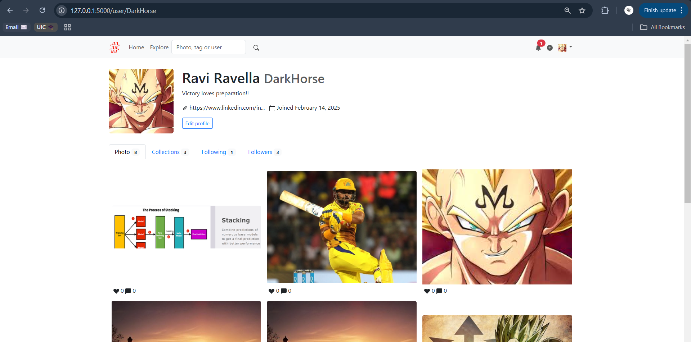
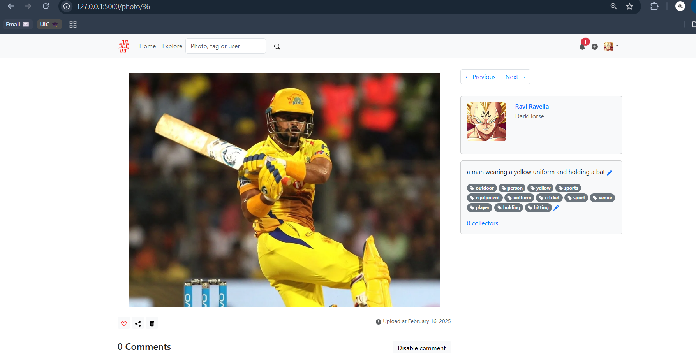

# Moments

A photo sharing social networking app with automated description and tags generation built with Python and Flask. The example application for the book *[Python Web Development with Flask (2nd edition)](https://helloflask.com/en/book/4)* (《[Flask Web 开发实战（第 2 版）](https://helloflask.com/book/4)》).

Demo: http://moments.helloflask.com





## Installation

Clone the repo:

```
$ git clone https://github.com/greyli/moments
$ cd moments
```

Install dependencies with [PDM](https://pdm.fming.dev):

```
$ pdm install
```

> [!TIP]
> If you don't have PDM installed, you can create a virtual environment with `venv` and install dependencies with `pip install -r requirements.txt`. If any dependency doesn't get installed when you run the above command, try installing those commands manually (`pip install ....`).

To initialize the app, run the `flask init-app` command:

```
$ pdm run flask init-app
```

If you just want to try it out, generate fake data with `flask lorem` command then run the app:

```
$ pdm run flask lorem
```

It will create a test account:

* email: `admin@helloflask.com`
* password: `moments`

Now you can run the app:

```
$ pdm run flask run
* Running on http://127.0.0.1:5000/
```

Also, you'll need your Microsoft Azure API Key and Endpoint so that the description and tags are generated automatically. For that, you'll need to do the following :

* Connecting to the Azure Vision API
    1. Sign up for the a student account for Microsoft Azure: https://azure.microsoft.com/en-us/free/students/ – no credit card required (for educational organizations only. For the rest, you need to pay.)

    2. Create an instance of the Computer Vision service and get an API endpoint of your instance of the service.

    3. Get a subscription key to authorize your script to call the Computer Vision API.

* Create a .env file and store your API key and endpoint in them in this format:

    `Endpoint="Your API Endpoint"`

   ` Key="Your API Key"`

* Now, remember that no one should see your API endpoint or key so make sure to add your .env file to .gitignore so that when you push the code to github, no one can see your credentianls thus, no one can use them.
## License

This project is licensed under the MIT License (see the
[LICENSE](LICENSE) file for details).
